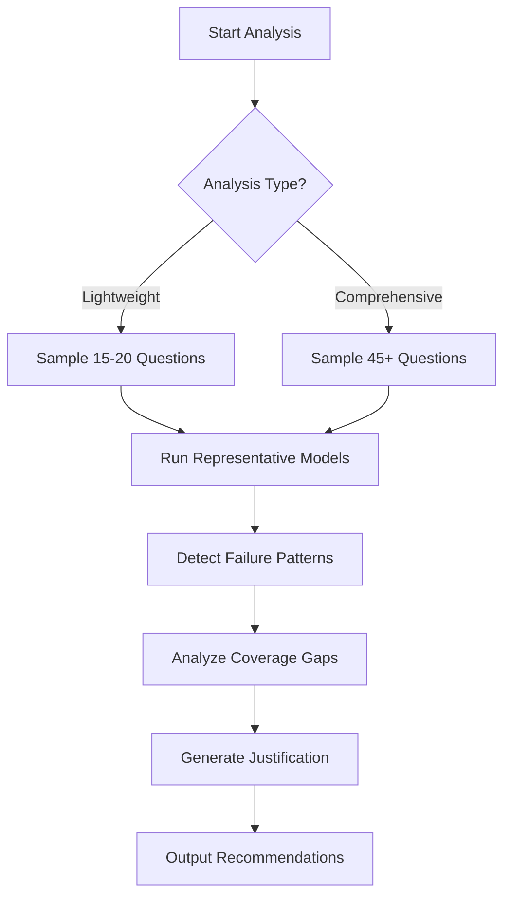

# Failure-Mode Analysis System

## Overview

A comprehensive system for identifying qualitative failure patterns in causal reasoning datasets. Designed to justify why new cases are needed by demonstrating that current coverage is sparse or unstable, not for comparing model performance.

## Key Features

### 🎯 Lightweight Analysis (Primary Mode)
- **Focus**: Representative patterns over exhaustive analysis
- **Models**: 1-2 representative evaluators (expert causal reasoning, domain-aware)
- **Output**: Justification for new cases with specific gap identification
- **Goal**: "These 45 cases expose X, but coverage is sparse/unstable"

### 📊 Pattern Detection Categories
1. **Conceptual Failures**: Pearl level misclassification, causal mechanism confusion
2. **Structural Failures**: Scenario-claim mismatch, logical contradictions  
3. **Ambiguity Failures**: Problematic (not productive) ambiguity in definitions
4. **Coverage Gaps**: Underrepresented Pearl×Trap combinations
5. **Instability Patterns**: Questions sensitive to minor wording changes

### 🤖 Representative Model Evaluation
- **Causal Reasoning Expert**: Rigorous Pearl Hierarchy application
- **Domain-Aware Evaluator**: Real-world knowledge integration
- **Output**: Systematic weaknesses, not competitive rankings

### 📈 Coverage Analysis
- Pearl level distribution and stability rates
- Trap type frequency and gap identification
- Combination coverage (L1×CONFOUNDING, L2×SELECTION, etc.)
- Instability metrics (>30% inconsistency threshold)

## API Usage

### Lightweight Analysis
```javascript
POST /api/admin/failure-analysis
{
  "analysisType": "lightweight",
  "questionLimit": 20,
  "focusAreas": ["L2", "CONFOUNDING"]  // Optional targeting
}
```

### Comprehensive Analysis  
```javascript
POST /api/admin/failure-analysis
{
  "analysisType": "comprehensive", 
  "questionLimit": 45
}
```

## Response Format

### Lightweight Response
```javascript
{
  "analysisType": "lightweight",
  "questionsAnalyzed": 20,
  "keyFindings": {
    "justification": "❌ CRITICAL: 3 fundamental failures...\n📊 SPARSE: 5 trap types <3 examples...",
    "criticalPatterns": [
      {
        "description": "Pearl level misclassification in L2 questions",
        "frequencyCount": 4,
        "suggestedNewCases": ["Need clearer L2 examples with unambiguous CONFOUNDING patterns"]
      }
    ],
    "coverageGaps": [...],
    "modelWeaknesses": [
      {
        "model": "causal-reasoning-expert", 
        "weaknesses": ["Incorrectly rejects valid SELECTION scenarios"],
        "recommendations": ["Need clearer SELECTION positive cases"]
      }
    ],
    "emergencyPriorities": ["CRITICAL: 3 critical failure patterns require immediate attention"]
  }
}
```

## Implementation Architecture

### Core Components

1. **FailureModeAnalyzer** (`/src/lib/failure-mode-analyzer.ts`)
   - Main analysis orchestration
   - Pattern detection algorithms
   - Coverage gap identification

2. **API Endpoint** (`/src/app/api/admin/failure-analysis/route.ts`)
   - Request handling and validation
   - Analysis mode routing
   - Response formatting

3. **Frontend Component** (`/src/components/FailureModeAnalysis.tsx`)
   - User interface for analysis configuration
   - Results visualization
   - Justification display

4. **Admin Integration** (`/src/app/admin/generate/page.tsx`)
   - Embedded in question generation workflow
   - Contextual analysis recommendations

### Analysis Workflow



## Pattern Detection Examples

### Conceptual Failures
```javascript
// Pearl Level Misclassification
{
  "description": "L3 labeled as L2 - counterfactual reasoning incorrectly classified",
  "severity": "HIGH",
  "suggestedNewCases": ["Need clear L3 counterfactual examples with temporal what-if structure"]
}
```

### Coverage Gaps
```javascript
// Sparse Combination
{
  "description": "Sparse coverage for L1 + SIMPSONS combination", 
  "frequencyCount": 1,
  "suggestedNewCases": ["Need 2 more diverse L1 + SIMPSONS scenarios"]
}
```

### Model Weaknesses
```javascript
// Representative Model Pattern
{
  "model": "domain-aware-evaluator",
  "systematicWeaknesses": ["Over-caution in medical scenarios"],
  "recommendedTargetCases": ["Need confidence-building medical cases with clear mechanisms"]
}
```

## Justification Framework

The system generates structured justifications following this template:

```
❌ CRITICAL: X fundamental failure patterns expose system-level weaknesses
📊 SPARSE: Y trap types have <3 examples, creating unstable coverage  
⚠️ UNSTABLE: Z areas show >30% instability rates
🎯 CONCLUSION: Current N cases expose key weaknesses but coverage is sparse/unstable
📈 NEED: M targeted new cases to stabilize learning
```

## Testing

### Manual Testing
1. Start development server: `npm run dev`
2. Navigate to: `http://localhost:3000/admin/generate` 
3. Use "Failure-Mode Analysis" section
4. Select "Lightweight" mode and run analysis

### Automated Testing
```bash
node test-failure-analysis.js
```

## Configuration

### Representative Models
Modify `/src/lib/failure-mode-analyzer.ts`:
```javascript
const REPRESENTATIVE_MODELS = [
  {
    id: 'causal-reasoning-expert',
    description: 'Expert-level causal reasoning evaluator',
    systemPrompt: 'You are an expert in Pearl\'s Causal Hierarchy...'
  }
  // Add additional representative models
];
```

### Failure Detection Thresholds
```javascript
// Coverage gap threshold (minimum questions per combination)
if (count < 3) { // Adjustable threshold

// Instability threshold (percentage of unstable questions)  
if (level.instabilityRate > 0.3) { // 30% threshold
```

## Integration Points

### With Question Generation
- Run analysis before large batch generation
- Use coverage gaps to guide trap type selection
- Apply recommendations to improve generation prompts

### With Quality Review
- Identify questions needing human review
- Prioritize evaluation based on failure patterns
- Guide reviewer attention to systematic issues

### With Dataset Export
- Include coverage analysis in export reports
- Warn about sparse areas before dataset release
- Recommend minimum viable coverage thresholds

## Future Enhancements

1. **Adaptive Sampling**: Dynamic question selection based on discovered patterns
2. **Confidence Intervals**: Statistical significance testing for pattern detection
3. **Template Analysis**: Integration with generation template failure detection
4. **Real-time Monitoring**: Continuous analysis during live question generation
5. **Historical Trending**: Pattern evolution tracking over time

## Troubleshooting

### Common Issues

**Empty Analysis Results**
- Check database connection
- Verify questions exist in database
- Ensure OpenAI API key is configured

**Rate Limiting Errors**
- Reduce questionLimit parameter
- Increase delays in analysis loops
- Check OpenAI API quotas

**TypeScript Compilation Errors**
- Run `npm run build` to check for type issues
- Verify all imports are properly typed
- Check array/object spread operator usage

### Performance Optimization

For large datasets (>100 questions):
1. Use lighthouse analysis with focusAreas
2. Implement result caching
3. Consider database indexing on pearlLevel, trapType
4. Add progress indicators for long-running analysis